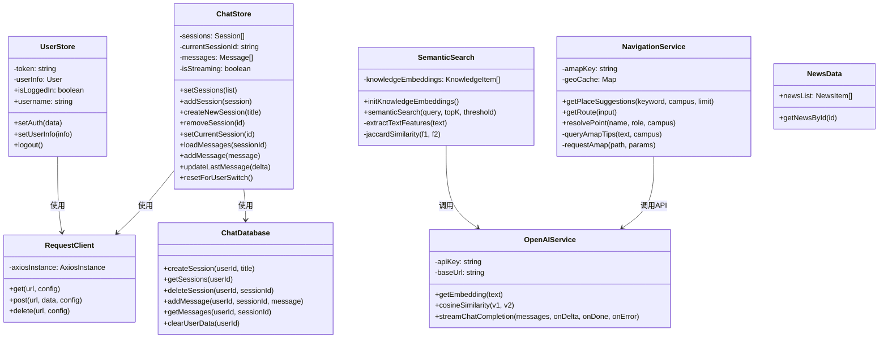
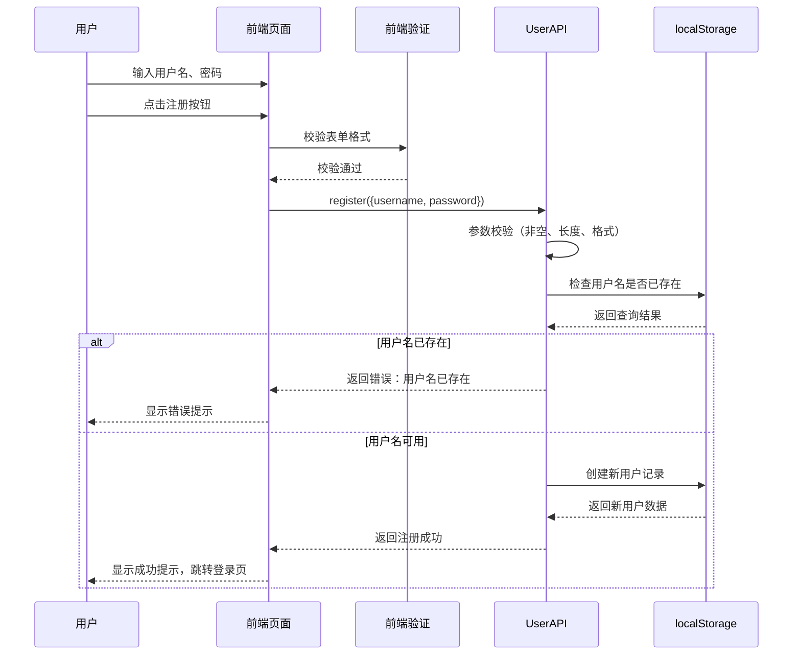
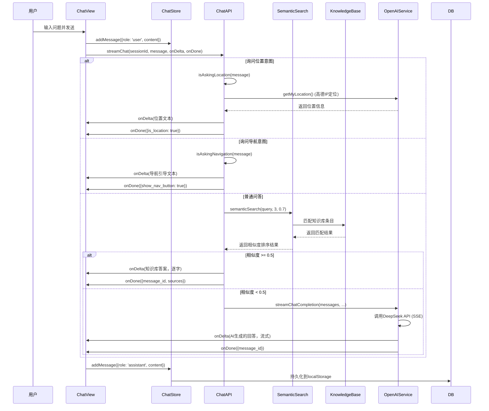
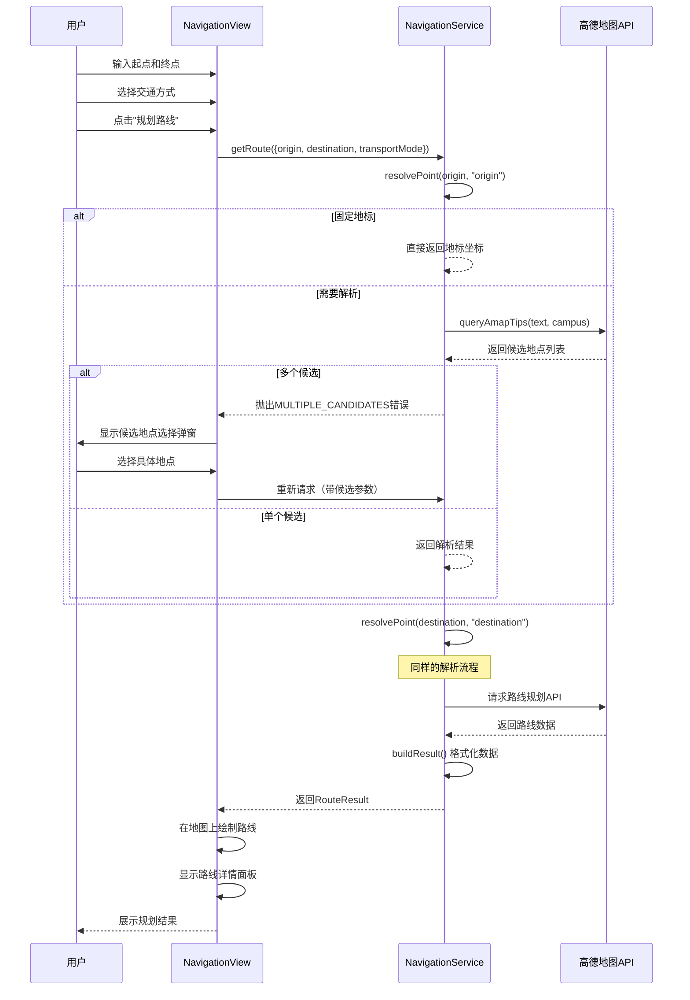
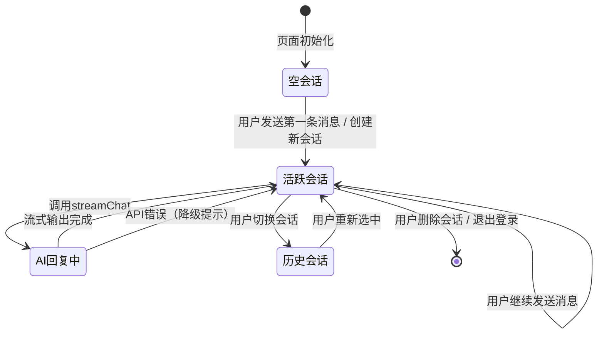
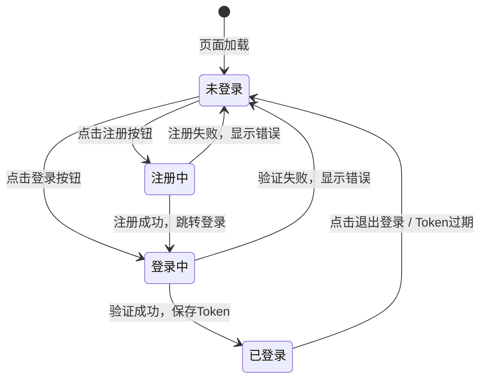

# 四川大学智能问答助手系统

## 软件设计说明书

**团队名称**：智慧校园开发团队

**日期**：2026年4月

---

## 目录

- 文档变更记录
- 1. 引言
  - 1.1 项目介绍
  - 1.2 开发团队
  - 1.3 使用的文字处理和绘图工具
- 2. 静态体系设计
  - 2.1 全局数据结构
  - 2.2 模块设计
    - 2.2.1 模块划分
    - 2.2.2 系统类图及说明
  - 2.3 界面设计
  - 2.4 数据库设计
- 3. 动态结构
  - 3.1 用例顺序图
  - 3.2 需说明的对象状态图
  - 3.3 内外部接口
- 4. 其他设计
  - 4.1 安全性设计
  - 4.2 系统错误处理
  - 4.3 系统性能设计
- 5. 附录
  - 5.1 词汇表
  - 5.2 参考文献

---

## 文档变更记录

| 序号 | 变更（+/-）说明 | 作者 | 版本号 | 日期 | 批准 |
|------|----------------|------|--------|------|------|
| 1 | 初始版本创建 | 王崇宇 | v1.0 | 2026-04-15 | |
| 2 | 增加校园工具模块和资讯模块设计 | 王崇宇 | v1.1 | 2026-04-15 | |

---

## 1. 引言

### 1.1 项目介绍

四川大学智能问答助手系统是一个面向四川大学师生的校园信息服务平台。该系统基于人工智能技术，整合了**智能问答（RAG + LLM）**、**校园导航**、**校园工具**和**校园资讯**四大核心功能模块，旨在为师生提供便捷、高效的校园信息查询与服务体验。

**项目意义**：
- 解决校园信息分散、查询困难的问题，实现一站式信息获取
- 利用AI技术提供7×24小时智能问答服务，减轻人工咨询压力
- 通过地图导航功能帮助新生和访客快速熟悉校园环境
- 提供实用的校园工具（GPA计算、教学周查询等），提升学习生活效率
- 集中展示校园新闻资讯，增强师生对校园动态的掌握

**核心技术**：
- 前端：Vue 3 + Vite + Element Plus
- 后端：FastAPI（Python）
- AI引擎：DeepSeek API（兼容OpenAI接口）
- 地图服务：高德地图Web API
- 数据持久化：localStorage（前端）+ SQLite/PostgreSQL（后端）

### 1.2 开发团队

| 角色 | 姓名 | 职责 |
|------|------|------|
| 项目负责人 | 王崇宇 | 项目整体规划、架构设计、核心功能开发 |
| 前端开发工程师 | 王崇宇 | 前端界面开发、交互实现、状态管理 |
| 后端开发工程师 | 王崇宇 | API接口开发、数据库设计、AI服务集成 |
| 测试工程师 | 王崇宇 | 功能测试、性能测试、用户体验优化 |

### 1.3 使用的文字处理和绘图工具

- **文字处理软件**：Markdown、Microsoft Word
- **绘图工具**：Draw.io（流程图、架构图）、Mermaid（类图、时序图）
- **原型设计**：Figma（界面原型设计）
- **代码编辑器**：Visual Studio Code

---

## 2. 静态体系设计

### 2.1 全局数据结构

#### 2.1.1 全局常量

| 常量名 | 值 | 说明 |
|--------|-----|------|
| `TOKEN_KEY` | `"scu_token"` | JWT Token存储键名 |
| `USER_KEY` | `"scu_user"` | 用户信息存储键名 |
| `USER_DB_KEY` | `"scu_user_database_v1"` | 本地用户数据库键名 |
| `CHAT_DB_KEY_PREFIX` | `"scu_chat_db_"` | 聊天数据库键名前缀 |
| `GEO_CACHE_KEY` | `"scu_nav_geocode_cache_v1"` | 地理编码缓存键名 |
| `DEFAULT_TIMEOUT` | `30000` | HTTP请求超时时间（毫秒） |

#### 2.1.2 全局枚举类型

```typescript
// 交通方式枚举
enum TransportMode {
  WALKING = "walking",   // 步行
  BIKING = "biking",     // 骑行
  DRIVING = "driving"    // 驾车
}

// 校区枚举
enum Campus {
  WANGJIANG = "wangjiang",  // 望江校区
  JIANGAN = "jiangan",      // 江安校区
  HUAXI = "huaxi",          // 华西校区
  ALL = "all"               // 全部校区
}

// 消息角色枚举
enum MessageRole {
  USER = "user",       // 用户
  ASSISTANT = "assistant",  // AI助手
  SYSTEM = "system"    // 系统
}
```

#### 2.1.3 全局共享数据结构

```typescript
// 用户数据结构
interface User {
  id: number;
  username: string;
  password?: string;      // 仅本地数据库使用
  createdAt: string;      // ISO 8601格式
}

// 会话数据结构
interface Session {
  id: string;
  userId: number | null;
  title: string;
  createdAt: string;
  updatedAt: string;
}

// 消息数据结构
interface Message {
  id: string;
  sessionId: string;
  role: MessageRole;
  content: string;
  sources?: Source[];     // 参考来源
  createdAt: string;
}

// 地点数据结构
interface Point {
  name: string;
  lnglat: [number, number];  // [经度, 纬度]
  address?: string;
  source?: string;           // landmark | tip | geocode | cache
}

// 路线规划结果
interface RouteResult {
  transportMode: TransportMode;
  origin: string;
  destination: string;
  origin_lnglat: [number, number];
  dest_lnglat: [number, number];
  distance: number;
  duration: number;
  distance_text: string;
  duration_text: string;
  steps: RouteStep[];
  polyline: string;
}

// 导航步骤
interface RouteStep {
  instruction: string;
  distance: string;
}

// 知识库条目
interface KnowledgeItem {
  id: number;
  question: string;
  answer: string;
  keywords: string[];
  category: string;
  similarity?: number;
  is_navigation?: boolean;
  nav_data?: NavigationData;
}

// 资讯数据结构
interface NewsItem {
  id: number;
  title: string;
  summary: string;
  content: string;
  image: string;
  tag: string;
  date: string;
  views: number;
  author: string;
}
```

### 2.2 模块设计

#### 2.2.1 模块划分

系统采用前后端分离架构，总体划分为以下模块：

```
四川大学智能问答助手系统
├── 前端应用（Vue 3 SPA）
│   ├── 用户认证模块
│   │   ├── 注册功能
│   │   ├── 登录功能
│   │   └── 状态管理（Pinia）
│   ├── 智能问答模块
│   │   ├── 会话管理
│   │   ├── 消息展示
│   │   ├── 流式对话
│   │   ├── RAG知识库检索
│   │   └── 意图识别（位置/导航）
│   ├── 校园导航模块
│   │   ├── 地图展示
│   │   ├── 路线规划
│   │   ├── 地点解析
│   │   └── 候选地点选择
│   ├── 校园工具模块
│   │   ├── GPA计算器
│   │   ├── 教学周查询
│   │   ├── 倒计时
│   │   └── 随机抽号
│   ├── 校园资讯模块
│   │   ├── 资讯列表
│   │   └── 资讯详情
│   └── 公共模块
│       ├── HTTP请求封装（Axios）
│       ├── 路由管理（Vue Router）
│       ├── 工具函数
│       └── 静态资源
└── 后端服务（FastAPI）
    ├── 用户认证服务
    │   ├── 注册接口
    │   ├── 登录接口
    │   └── JWT Token管理
    ├── 会话管理服务
    │   ├── 会话CRUD
    │   └── 消息记录
    ├── 智能问答服务
    │   ├── 流式问答（SSE）
    │   └── RAG检索
    └── 校园导航服务
        └── 路线规划接口
```

#### 2.2.2 系统类图及说明



**类说明**：

| 类名 | 职责 | 所在文件 |
|------|------|----------|
| UserStore | 管理用户登录状态、Token、用户信息 | `src/stores/user.js` |
| ChatStore | 管理会话列表、当前会话、消息列表 | `src/stores/chat.js` |
| ChatDatabase | 封装localStorage操作，实现按用户隔离的持久化 | `src/utils/chatDatabase.js` |
| RequestClient | 封装Axios实例，统一处理鉴权和错误 | `src/utils/request.js` |
| SemanticSearch | 基于关键词的知识库语义检索 | `src/utils/semanticSearch.js` |
| OpenAIService | 封装DeepSeek/OpenAI API调用 | `src/utils/openai.js` |
| NavigationService | 封装高德地图API调用，实现地点解析和路线规划 | `src/api/navigation.js` |
| NewsData | 管理校园资讯静态数据 | `src/data/newsData.js` |

### 2.3 界面设计

#### 2.3.1 设计风格

- **整体风格**：简洁现代，以四川大学校徽红色（#9b1b30）为主色调
- **布局**：响应式设计，适配桌面端和移动端
- **字体**：系统默认字体栈，中文优先使用思源黑体/微软雅黑
- **圆角**：统一使用8px-16px圆角，卡片使用12px-20px圆角
- **阴影**：采用柔和的层级阴影（box-shadow: 0 4px 20px rgba(0,0,0,0.08)）

#### 2.3.2 页面清单

| 页面名称 | 路由 | 说明 | 是否需要登录 |
|----------|------|------|-------------|
| 首页 | `/` | 轮播图、功能入口、校园资讯 | 否 |
| 登录页 | `/login` | 用户登录表单 | 否 |
| 注册页 | `/register` | 用户注册表单 | 否 |
| 智能问答 | `/chat` | 对话界面、会话管理 | **是** |
| 校园导航 | `/nav` | 地图、路线规划 | 否 |
| 校园工具 | `/tools` | 工具箱入口、各工具面板 | 否 |
| 资讯列表 | `/news` | 全部资讯、标签筛选 | 否 |
| 资讯详情 | `/news/:id` | 单篇资讯详细内容 | 否 |

#### 2.3.3 关键界面设计图

**首页（HomeView）布局**：
```
+--------------------------------------------------+
|  [Logo]  四川大学智能助手        [导航菜单] [登录] |
+--------------------------------------------------+
|                                                  |
|              [全屏轮播图区域]                     |
|         自动切换 / 指示器 / 左右箭头               |
|                                                  |
+--------------------------------------------------+
|  [智能问答]  [校园导航]  [校园工具]  [校园资讯]    |
|     卡片式功能入口，悬停动效                        |
+--------------------------------------------------+
|  [校园资讯区域]                                   |
|  [大图精选] | [资讯列表]                          |
|  [查看更多 →]                                     |
+--------------------------------------------------+
|  [数据统计区域]  红色背景                          |
|  服务师生数 | 回答问题数 | 覆盖校区数 | 工具数量   |
+--------------------------------------------------+
|  [页脚]                                          |
+--------------------------------------------------+
```

**智能问答页（ChatView）布局**：
```
+--------------------------------------------------+
| [Logo]                        [用户头像] [退出]  |
+--------------------------------------------------+
| [会话列表] |                                    |
|  - 会话1    |      [消息展示区域]                 |
|  - 会话2    |      - 用户消息（右对齐）            |
|  - 会话3    |      - AI回复（左对齐，Markdown）    |
|  + 新对话   |                                    |
|             |      [输入框] [发送按钮]             |
|             |      [建议问题标签]                  |
+--------------------------------------------------+
```

**校园导航页（NavigationView）布局**：
```
+--------------------------------------------------+
| [Logo]  校园导航                                  |
+--------------------------------------------------+
|                                                  |
|  [校区选择: 全部 ▼]                              |
|  [起点输入框] [交换] [终点输入框] [规划路线]      |
|  [步行] [骑行] [驾车]                            |
|                                                  |
|  +------------------------------------------+    |
|  |                                          |    |
|  |           [高德地图展示区域]               |    |
|  |                                          |    |
|  +------------------------------------------+    |
|                                                  |
|  [路线详情面板 - 展开/折叠]                       |
|  - 总距离 | 预计时间                            |
|  1. 沿XX路步行XX米                               |
|  2. 右转进入XX路                                 |
+--------------------------------------------------+
```

### 2.4 数据库设计

#### 2.4.1 用户表（users）

| 字段名 | 类型 | 约束 | 说明 |
|--------|------|------|------|
| id | INTEGER | PRIMARY KEY, AUTO_INCREMENT | 用户ID |
| username | VARCHAR(64) | NOT NULL, UNIQUE | 用户名 |
| password | VARCHAR(128) | NOT NULL | 密码（bcrypt加密） |
| created_at | DATETIME | DEFAULT CURRENT_TIMESTAMP | 创建时间 |

#### 2.4.2 会话表（sessions）

| 字段名 | 类型 | 约束 | 说明 |
|--------|------|------|------|
| id | INTEGER | PRIMARY KEY, AUTO_INCREMENT | 会话ID |
| user_id | INTEGER | FOREIGN KEY (users.id) | 用户ID |
| title | VARCHAR(255) | NOT NULL | 会话标题 |
| created_at | DATETIME | DEFAULT CURRENT_TIMESTAMP | 创建时间 |
| updated_at | DATETIME | DEFAULT CURRENT_TIMESTAMP | 更新时间 |

#### 2.4.3 消息表（messages）

| 字段名 | 类型 | 约束 | 说明 |
|--------|------|------|------|
| id | INTEGER | PRIMARY KEY, AUTO_INCREMENT | 消息ID |
| session_id | INTEGER | FOREIGN KEY (sessions.id) | 会话ID |
| role | ENUM('user','assistant','system') | NOT NULL | 消息角色 |
| content | TEXT | NOT NULL | 消息内容 |
| sources | JSON | NULL | 参考来源（JSON数组） |
| created_at | DATETIME | DEFAULT CURRENT_TIMESTAMP | 创建时间 |

#### 2.4.4 知识库表（knowledge_base）

| 字段名 | 类型 | 约束 | 说明 |
|--------|------|------|------|
| id | INTEGER | PRIMARY KEY, AUTO_INCREMENT | 条目ID |
| question | VARCHAR(500) | NOT NULL | 问题文本 |
| answer | TEXT | NOT NULL | 答案文本 |
| keywords | JSON | NOT NULL | 关键词数组 |
| category | VARCHAR(50) | NOT NULL | 分类 |
| embedding | JSON | NULL | 向量嵌入（可选） |
| is_navigation | BOOLEAN | DEFAULT FALSE | 是否为导航类 |
| nav_data | JSON | NULL | 导航数据 |
| created_at | DATETIME | DEFAULT CURRENT_TIMESTAMP | 创建时间 |

#### 2.4.5 本地存储结构（localStorage）

```
scu_token: string              // JWT Token
scu_user: JSON<User>           // 用户信息
scu_user_database_v1: JSON<{ users: User[] }>  // 本地用户数据库
scu_chat_db_<userId>: JSON<{ sessions: Session[], messages: Message[] }>  // 聊天数据
scu_nav_geocode_cache_v1: JSON<Map<string, Point>>  // 地理编码缓存
```

---

## 3. 动态结构

### 3.1 用例顺序图

#### 3.1.1 用户注册顺序图



#### 3.1.2 智能问答顺序图



#### 3.1.3 校园导航顺序图



### 3.2 需说明的对象状态图

#### 3.2.1 会话（Session）状态图



#### 3.2.2 用户认证状态图



### 3.3 内外部接口

#### 3.3.1 内部接口（前端模块间）

| 接口名 | 调用方 | 提供方 | 说明 |
|--------|--------|--------|------|
| `userStore.setAuth(data)` | LoginView | UserStore | 登录成功后设置认证信息 |
| `userStore.logout()` | AppLayout | UserStore | 退出登录，清除状态 |
| `chatStore.createNewSession(title)` | ChatView | ChatStore | 创建新会话 |
| `chatStore.loadMessages(sessionId)` | ChatView | ChatStore | 加载会话消息 |
| `chatStore.addMessage(msg)` | ChatView | ChatStore | 添加消息到当前会话 |
| `request.get/post/delete()` | 各API模块 | RequestClient | HTTP请求 |

#### 3.3.2 外部接口（前后端交互）

| 接口路径 | 方法 | 鉴权 | 说明 |
|----------|------|------|------|
| `/api/auth/register` | POST | 否 | 用户注册 |
| `/api/auth/login` | POST | 否 | 用户登录 |
| `/api/auth/me` | GET | 是 | 获取当前用户信息 |
| `/api/sessions` | GET | 是 | 获取会话列表 |
| `/api/sessions` | POST | 是 | 创建新会话 |
| `/api/sessions/:id` | DELETE | 是 | 删除会话 |
| `/api/sessions/:id/messages` | GET | 是 | 获取会话消息 |
| `/api/chat` | POST | 是 | 流式问答（SSE） |
| `/api/navigation/route` | POST | 是 | 路线规划 |

#### 3.3.3 第三方服务接口

| 服务 | 接口地址 | 说明 | 调用位置 |
|------|----------|------|----------|
| DeepSeek API | `https://api.deepseek.com/chat/completions` | AI对话生成 | `src/utils/openai.js` |
| 高德地图-输入提示 | `https://restapi.amap.com/v3/assistant/inputtips` | 地点搜索建议 | `src/api/navigation.js` |
| 高德地图-地理编码 | `https://restapi.amap.com/v3/geocode/geo` | 地址转坐标 | `src/api/navigation.js` |
| 高德地图-步行路线 | `https://restapi.amap.com/v3/direction/walking` | 步行路线规划 | `src/api/navigation.js` |
| 高德地图-骑行路线 | `https://restapi.amap.com/v4/direction/bicycling` | 骑行路线规划 | `src/api/navigation.js` |
| 高德地图-驾车路线 | `https://restapi.amap.com/v3/direction/driving` | 驾车路线规划 | `src/api/navigation.js` |
| 高德地图-IP定位 | `https://restapi.amap.com/v3/ip` | 获取当前位置 | `src/api/chat.js` |
| 高德地图-JS API | `https://webapi.amap.com/maps` | 前端地图渲染 | `index.html` |

---

## 4. 其他设计

### 4.1 安全性设计

#### 4.1.1 说明

系统涉及用户认证、个人会话数据等敏感信息，需要在多个层面保障安全性。

#### 4.1.2 数据传输设计

1. **HTTPS协议**：所有API请求均通过HTTPS协议传输，防止中间人攻击
2. **JWT Token**：采用JWT（JSON Web Token）进行身份验证
   - Token存储在localStorage中
   - 每次请求自动附加到Authorization请求头：`Bearer <token>`
   - Token包含用户ID和过期时间
3. **请求超时**：HTTP请求设置30秒超时，防止长时间挂起
4. **CORS配置**：后端配置跨域策略，仅允许前端域名访问

#### 4.1.3 身份验证设计

1. **注册验证**：
   - 用户名：4-20位，仅限字母、数字、下划线
   - 密码：至少6位，最长50位
   - 用户名唯一性校验

2. **登录验证**：
   - 用户名密码匹配校验
   - 不暴露具体错误（统一返回"用户名或密码错误"）
   - 登录成功后返回JWT Token

3. **路由守卫**：
   - 未登录用户访问需鉴权页面自动跳转登录页
   - 已登录用户访问登录/注册页自动跳转首页
   - Token过期（401响应）自动清理本地状态并跳转登录

4. **前端本地数据库**：
   - 用户数据按用户ID隔离存储
   - 切换用户时自动重置聊天状态
   - 密码以明文存储在localStorage（开发阶段），生产环境应使用后端加密

### 4.2 系统错误处理

#### 4.2.1 错误分类与处理策略

| 错误类型 | 场景 | 处理方式 | 用户提示 |
|----------|------|----------|----------|
| 网络错误 | 后端服务未启动 | 请求拦截器捕获 | "网络错误，请检查后端服务是否启动" |
| 401错误 | Token过期或无效 | 清除本地状态，跳转登录 | 自动跳转登录页 |
| API错误 | DeepSeek API调用失败 | 降级到知识库回答 | "暂时无法连接到AI服务，可从知识库为您解答" |
| 参数错误 | 用户名/密码格式不对 | 前端预校验 | 具体格式错误提示 |
| 导航错误 | 地点未找到 | 抛出异常，弹窗提示 | "未找到地点：XXX" |
| 多候选错误 | 地点有多个匹配 | 弹窗让用户选择 | 显示候选地点列表 |

#### 4.2.2 统一错误界面

系统使用Element Plus的`ElMessage`组件进行轻量级错误提示，对于需要用户操作的错误（如多候选地点选择），使用`ElDialog`弹窗组件。

```javascript
// 错误提示示例
ElMessage.error('用户名或密码错误');
ElMessage.warning('请输入有效的起点和终点');
ElMessage.info('请先选择一个候选地点');
ElMessage.success('登录成功');
```

### 4.3 系统性能设计

#### 4.3.1 响应时间要求

| 操作 | 目标响应时间 | 说明 |
|------|-------------|------|
| 页面首屏加载 | < 2秒 | 资源懒加载、代码分割 |
| 用户登录/注册 | < 500ms | 本地数据库操作 |
| 会话列表加载 | < 300ms | 本地存储读取 |
| 流式问答首字响应 | < 3秒 | DeepSeek API首次返回 |
| 地点搜索建议 | < 500ms | 高德API + 本地缓存 |
| 路线规划 | < 2秒 | 高德路线API |
| 地图渲染 | < 1秒 | 前端地图组件初始化 |

#### 4.3.2 性能优化措施

1. **前端优化**：
   - Vite代码分割，路由级懒加载
   - 图片资源压缩和懒加载
   - 地图组件按需加载
   - localStorage读写优化（批量操作）

2. **缓存策略**：
   - 地理编码结果本地缓存（`scu_nav_geocode_cache_v1`）
   - 用户登录状态本地持久化
   - 会话数据本地持久化（减少API调用）

3. **API优化**：
   - 知识库预计算向量（减少Embedding API调用）
   - 相似度阈值过滤（0.7），减少无效匹配
   - 流式输出（SSE），提升用户体验

4. **降级策略**：
   - DeepSeek API失败时，自动降级到知识库回答
   - 高德API失败时，使用固定地标数据兜底
   - 网络异常时，提供友好的错误提示

---

## 5. 附录

### 5.1 词汇表

| 序号 | 术语或缩略语 | 说明性定义 |
|------|-------------|-----------|
| 1 | AI | Artificial Intelligence，人工智能 |
| 2 | LLM | Large Language Model，大语言模型 |
| 3 | RAG | Retrieval-Augmented Generation，检索增强生成 |
| 4 | SSE | Server-Sent Events，服务器推送事件 |
| 5 | JWT | JSON Web Token，JSON网络令牌 |
| 6 | API | Application Programming Interface，应用程序接口 |
| 7 | SPA | Single Page Application，单页应用 |
| 8 | POI | Point of Interest，兴趣点 |
| 9 | CDN | Content Delivery Network，内容分发网络 |
| 10 | CORS | Cross-Origin Resource Sharing，跨域资源共享 |
| 11 | GPA | Grade Point Average，平均学分绩点 |
| 12 | DOM | Document Object Model，文档对象模型 |
| 13 | URI | Uniform Resource Identifier，统一资源标识符 |
| 14 | WGS84 | 世界大地测量系统1984，GPS坐标标准 |
| 15 | GCJ-02 | 国测局坐标系，中国地图坐标标准 |

### 5.2 参考文献

1. Vue.js 官方文档. https://vuejs.org/
2. Element Plus 官方文档. https://element-plus.org/
3. FastAPI 官方文档. https://fastapi.tiangolo.com/
4. DeepSeek API 文档. https://platform.deepseek.com/
5. 高德地图 Web API 文档. https://lbs.amap.com/api/webservice/summary
6. 高德地图 JavaScript API 文档. https://lbs.amap.com/api/jsapi-v2/summary
7. Pinia 官方文档. https://pinia.vuejs.org/
8. Vue Router 官方文档. https://router.vuejs.org/
9. Axios 官方文档. https://axios-http.com/
10. Markdown 语法说明. https://www.markdownguide.org/
11. 《四川大学信息化建设规划（2024-2028）》
12. RESTful API 设计规范. https://restfulapi.net/

---

**团队名称**：智慧校园开发团队

**团队成员**：

| 学号 | 姓名 |
|------|------|
| 2023141461054 | 王崇宇 |

**团队贡献分**：

| 学号 | 姓名 | 贡献分 |
|------|------|--------|
| 2023141461054 | 王崇宇 | 10分 |

---

*得分：（教师填写）*

*评语：（教师填写）*
